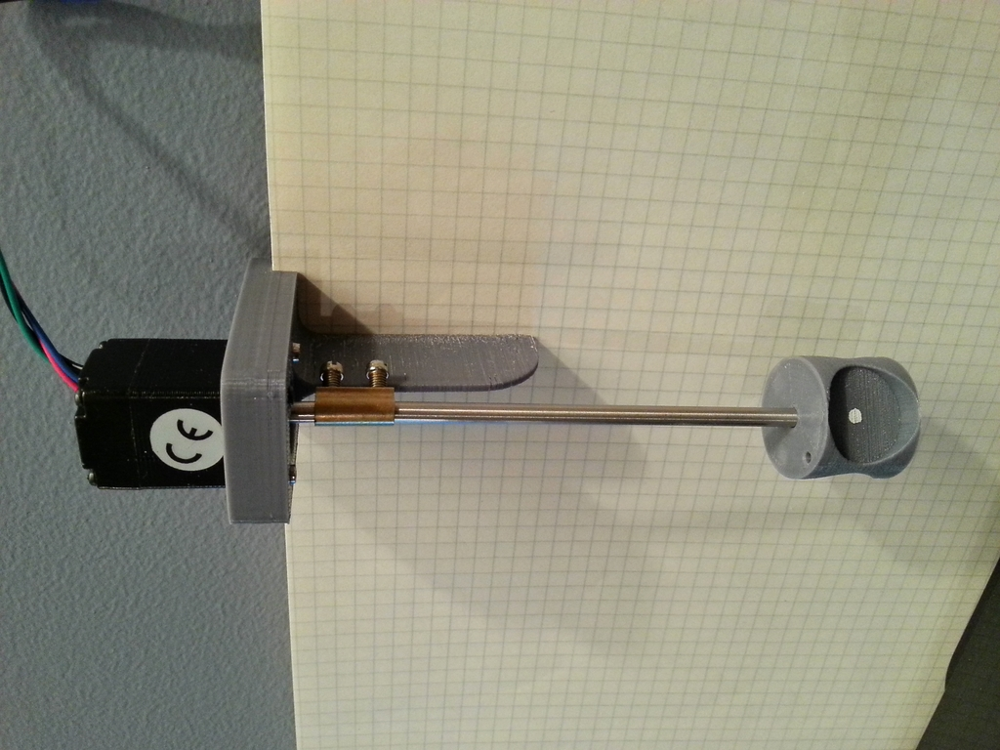

# Sonde d'expérimentation en aquarium  - 2016-06-10

Hyacinthe Joris , voici quelques infos pour réaliser une sonde d'expérimentation à pincer sur le bord de l'aquarium. 

[20160319_194819_HDR.jpg 4.35 MB • Download](../bc3-images/6221602-20160319_194819_hdr.jpg)

  **Ingrédients**

 * [DRV8834 Low-Voltage Stepper Motor Driver Carrier](https://www.pololu.com/product/2134).  * [Stepper Motor: Bipolar, 200 Steps/Rev, 20×30mm, 3.9V, 0.6 A/Phase](https://www.pololu.com/product/1204).  * 4 vis M2.  * Axe de 4mm.  * Support et tambour réalisés en impression 3D en PLA.

  **Remarques**

 * Envisager des clips pour guider le fil le long de l'axe jusqu'au transducteur.  * Les petites vis du coupleur d'axe butent sur le support et c'est normal, cela permet de repérer une origine de position 0 en faisant "reculer" pendant 360° et caler le moteur sur cette butée. Cela évite aussi de faire des noeuds avec les fils du transducteur en cas de fausse manip.  * Le moteur et le driver ont été achetés chez Lextronic mais il semble qu'ils n'aient pas le moteur dispo en ce moment, le mien était &lt; 20€  * On pourrait essayer avec un moteur de CD-ROM mais je ne sais pas si il serait assez puissant.  * **ATTENTION : avant toute chose**, il faut régler le courant maxi sur le driver (§ "Current limiting"). Sinon le moteur peut très vite surchauffer même à l'arrêt. Sachant qu'on va "caler" le moteur sur une butée, on va chercher à régler le courant sur le minimum qui permet de ne pas perdre de pas mais qui permette de ne pas trop forcer sur la butée. Tout cela sera à expérimenter avec le transducteur en place (voir 3 transducteurs).  * Ce driver Pololu a l'avantage de fonctionner dès 2.5V. Donc tout fonctionne bien sous 5V.  * Le moteur est un 200 pas/tr mais le driver descend jusqu'au 1/32 de pas.  * Sur mes tests, en pilotant le moteur en 1/8, soit 1600 pas et en trichant un peu sur le secteur balayé (67.5°) cela donne un secteur de 300 pas et un tir tous les 1.5 pas. Soit un tir tous les 3 fronts (montants ou descendants) du signal de commande du driver.  La fréquence d'IT pour générer le signal de commande sera alors de 9 kHz pour obtenir 15 fps. Tout cela devant être ajustable en jouant sur les différents paramètres. L'idée à terme étant de déporter au maximum la génération de ces signaux dans les timers du µC pour libérer des cycles CPU.  * On considère pour l'instant que le moteur a assez de couple pour inverser son mouvement en un seul pas. Sinon il faudra affiner la loi de vitesse.

  Ci-joint, un source, un peu expérimental ;-), en µPython d'une version n'utilisant pas au maximum des timers et qui consomme déjà 22% de CPU sur un STM32F405 à 160 MHz. 

[ main-v1.py 3.95 KB • Download](../bc3-images/6223271-main-v1.py)

  PS 1: je ne peux pas passer ce vendredi 10/06 mais je vous prêterai qq composants lundi pour commencer à maniper et éviter de perdre du temps pendant l'appro.   PS 2 : @tous, ce post est peut-être un peu technique pour être déposé sur BaseCamp ? Qu'en pensez-vous ?.**  **

### **Hyacinthe** - 2016-06-10 at 12:50 PM

Post sur github (tutoriels.md dans le bon module) avec copie sur le wiki?

### **Hyacinthe** - 2016-06-10 at 1:08 PM

Yep ! C'est vrai. Je suis tjs un peu coincé sur GH tant que je n'ai pas fait le ménage et calé l'architecture de mon dépot.

