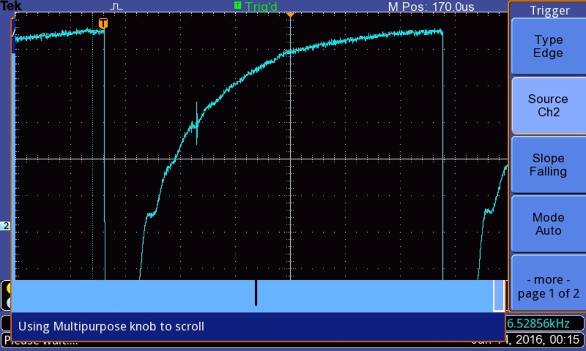

# What's new  - 2016-01-13

Hey hey tout le monde.   On vient de tester le circuit analogique (pulse à environ -60V + T/R switch) et on arrive maintenant à voir un echo venant d'une partie du corps humain (en occurrence ma main) : 

[TEK0002.JPG 165 KB • Download](../bc3-images/789676-tek0002.JPG)

  Ca demande encore du travail, mais c'est déjà une bonne avancée :)

### **Hyacinthe** - 2016-01-13 at 4:45 PM

Top top top !

### **Hyacinthe** - 2016-01-13 at 4:47 PM

Sweet !!!!  Moyenne sur X signaux ou sur une acquisition unique?

### **Hyacinthe** - 2016-01-13 at 4:50 PM

Bravo ;) Impatient de voir ça...

### **Hyacinthe** - 2016-01-13 at 4:51 PM

On ne fait pas de moyenne ici

### **Hyacinthe** - 2016-01-13 at 4:53 PM

Ça gère !! Écho sur l'autre côté de ta main? Ou rebond sur ta main dans l'eau ?

### **Hyacinthe** - 2016-01-13 at 4:56 PM

La main est dans l'eau, il faudrait zoomer pour en savoir un peu plus. Quid de la peau ou d'un os qui donne un echo? Je pencherai plus pour un os

### **Hyacinthe** - 2016-01-13 at 5:17 PM

En zoomant c'est vrai qu'il y a plusieurs échos qui semblent apparaître!  Ça vaudrait le coup de chopper abextla pitaya Xx échantillons sans la main pour avoir la baseline, moyennee, et qques échantillons avec la main, pour en retirer la baseline et voir ce qu'introduit ta main en termes d'échos? A-mode rocks ;)

