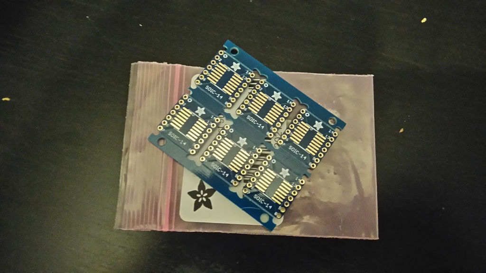

# Réunion Hébdo Echopen @HD  - 2016-02-01

Bonjour à tous,   En prévision de notre réunion hebdo de ce soir à 19.00 à l'HD, voici l'agenda que je vous propose. Vous pouvez le compléter directement sur le [google doc](https://docs.google.com/document/d/1QvdCm2CYsujH8HKidR_w9i20oFb5dsWRUXKGGW8xfrw/edit#).   A ce soir   O.  \--  Ordre du jour 25.01.2016   

 * **Développements technologiques =&gt; Avancés de la semaine **   * [Bilan des avancées de chaque module](https://docs.google.com/spreadsheets/d/17jtXg-r6_nDEFxN0xtRFjEYXCeVaxZG9clrJDgage0o/edit#gid=0) =&gt; Évaluer le délai d’obtention du prototype     * Transducteur     * Mécanique     * Électronique (besoin de matériel CMS ?)    * REDPI    * Enveloppe physique du dispositif    * Avancés de la déclinaison des besoins médicaux en exigences techniques (EMM / MUG)    * Documentation wiki    * Définition d’une date pour réunion tech :     * Caler les activités précises des 6 prochains mois (amélioration du dispositif) =&gt; Objectif financement et planning de développement     * En déduire un prochain CapTech pour mars 2016   * **Communauté**    * Rencontre JC billard #électronique V2   * Bilan des travaux de Greg  * **Point Outils**   * Statut du serveur web et du nouveau wiki   * Q&amp;A   * Outils BC 3 (rappel du fonctionnement)   * **Events**   * Apéros de vendredi   * Prochain apéro =&gt;    * Hyacinthe sur le développement du transducteur (?)

### **Hyacinthe** - 2016-02-02 at 2:17 PM

**Compte rendu du 01/02**   Vous pouvez trouver le CR sur ce le [google doc](https://docs.google.com/document/d/1QvdCm2CYsujH8HKidR_w9i20oFb5dsWRUXKGGW8xfrw/edit#). Si vous avez des modifications à apporter.     CR 01.02.2016   

 * Développements technologiques  * Le transducteur made in echopen est arrivé à l’hotel dieu, dimension : diamètre 15 mm, hauteur 18.7 mm. Il reste un faire un support pour le fixer sur la mécanique.  * Temps minimum entre deux pulses environ 250 us.  * Le kit de développement TGC fonctionne, on va commencer par travailler avec. La conception d’un TGC est ardue. Il ne reste plus qu’à assembler les différents modules entre eux.  * Problème de bruit électronique du à l’arduino.  * Programme et simulation d’un code VHDL (pour notre propre FPGA) sont près. FAK a trouvé des codes de transformée de Hilbert et de transfert par USB open source.  * Greg : il a fait la scan conversion via opencv, il monte jusqu’à 35 fps. En wifi point à point on atteint 3 Mops (ça peut augmenter avec un meilleur dongle wifi). Il a fait un code de transfert de données avec protocole TCP pour plus de sécurité (pas de perte de paquets ainsi).  * EMM, MUG : la fonction signal processing à été décomposé.  * Miscellaneous  * Soutenance VIL et FAK Vendredi à l’hotel dieu à 13h30.  * Olga et Yohan vont venir observer nos méthodes de travail afin de nous aider à mettre en place des outils d’aide sur les enjeux collaboratif et les méthodes de travail.  * Samedi 6 discussion le future d’echopen à l’hotel dieu pour une vision sur les six prochains mois (budget, communauté..). Définition d’un cap tech peu après la démonstration puis d’un cap med sur l’utilisation d’échographes ultraportables.  * Retour réunion bitmaker (ECG miniature) : il veulent se positionner sur de l’open source (question comm). Ils ont conseillé de commencer par des simulations pour les FPGAs avant de coder en dure. Ils veulent se mettre à la fabrication d’un échographe cardiaque donc ils cherche également du savoir faire. Ils aimeraient s’installer à l’hotel dieu pour avoir un premier pas dansle milieu médical.  * Réflexion autour du deep learning : réseau de neurone pour la détection de contour d’organes. Cela nécessite une grosse base de données + accéléro et gyro pour déterminer le plan de mesure de la sonde.

### **Hyacinthe** - 2016-02-08 at 7:56 AM

Bonjour,   Voici l'ODJ de ce soir. RDV à 19.00 à l'HD (on essai de boucler la réunion en 1 heure); A ce soir.  \--  Ordre du jour 08.02.2016

 * **Développements technologiques =&gt; Avancés de la semaine **   * [Bilan des avancées de chaque module](https://docs.google.com/spreadsheets/d/17jtXg-r6_nDEFxN0xtRFjEYXCeVaxZG9clrJDgage0o/edit#gid=0) + matrice &amp; tableau récapitulatif de l’architecture avec versions et justifiction =&gt; en vue des fiches wiki    * Transducteur     * Mécanique     * Électronique    * REDPI    * App     * Enveloppe physique du dispositif    * Assemblage =&gt; Suivi des avancées    * Déclinaison des besoins médicaux en exigences techniques (EMM / MUG)   * **Communauté**    * Retour sur la réunion de samedi =&gt; Mise en place des méthodes pour une inclusion communautaire plus grande.   * **Point Outils**   * Statut du serveur web et du nouveau wiki   * Q&amp;A   * **Events**   * Apéros de vendredi   * Soirée de release du proto V1 fonctionnel

### **Hyacinthe** - 2016-02-08 at 8:01 AM

Hi Hyacinthe,   Vu la densité de la réu de samedi, et tout ce qui a ete abordé, on s est dit qu on a traité au passage les questions de la réu de bureau et qu on peut remettre  l réu !   @++

### **Hyacinthe** - 2016-02-08 at 8:19 AM

Hyacinthe lacenne  Je ne saisie pas de quelles questions tu parles. En tout cas n'hésites pas à ajouter des points dans le google doc directement.

### **Hyacinthe** - 2016-02-08 at 8:34 AM

;) je n'ai pas été clair :  en fait on s'est dit qu'on pouvait reporter à la semaine pro le prochain bureau

### **Hyacinthe** - 2016-02-08 at 8:44 AM

Comme l'a dit Hyacinthe,  Nous avons abordé beaucoup de choses Samedi, et du coup, tout est déjà dit. La réunion de ce soir ne ferait qu'apporter des détails triviaux sur nos travaux de Dimanche et d'aujourd'hui, ce qui n'est pas vraiment très conséquent, et remplirait la réunion pour 10 minutes tout au plus.  Considérant ce fait, nous nous étions dit que faire venir tout le monde pour 10 minutes était peut-être inutile =&gt; Reporter la réunion ;)

### **Hyacinthe** - 2016-02-08 at 3:41 PM

Ok. Donc pas de réunion ce soir. Prochain RDV =&gt; Lundi 15.02 //

### **Hyacinthe** - 2016-02-15 at 11:03 AM

Bonjour à tous,  L'ODJ de la réunion de ce soir est disponible [ici](https://docs.google.com/document/d/1QvdCm2CYsujH8HKidR_w9i20oFb5dsWRUXKGGW8xfrw/edit#). A ce soir.

### **Hyacinthe** - 2016-02-15 at 11:19 AM

cool - updaté ;)

### **Hyacinthe** - 2016-02-16 at 9:33 AM

Voici le compte rendu de la réunion d'hier, disponible [ici](https://docs.google.com/document/d/1QvdCm2CYsujH8HKidR_w9i20oFb5dsWRUXKGGW8xfrw/edit#) :     CR 15.02.2016   

 * Développements technologiques  * Électronique : problème de bruit (du même ordre de grandeur que les échos). Voir si Gérard Chapilier peut passer.  * La Red Pitaya n’obéit plus et elle a peut être une entrée analogique cramée.  * Murgen : premiers tests bientôt.   * LUJ en contact avec l’Universitée de Tenesse qui fabrique une sonde low cost.  * Contacter Hyacinthe pour connaître les avancements sur le transducteur. (Quand pourrat-on avoir un transducteur fin).   * Pour le 10 Mars : on aura la mécanique d’un côté, l’électronique de l’autre, on utilisera probablement le transducteur imasonic.  * Cette semaine : tester le montage complet pour voir si des problèmes apparaisses (voir avec MEB pour le côté appli et smartphone).  * FAK pusher les codes vhdl sur le github.  * Miscellaneous  * Préparer une petite réunion électronique avec la communauté (FAK part fin Février).  * Documentation : sur wiki ou sur github?

### **Hyacinthe** - 2016-02-22 at 1:41 PM

Hello All,   Pour le réunion de ce soir, voici l'ODJ disponible [ici](https://docs.google.com/document/d/1QvdCm2CYsujH8HKidR_w9i20oFb5dsWRUXKGGW8xfrw/edit#heading=h.1zpe488eg7dx).   Vous pouvez ajouter vos remarques en restant raisonnable car notre concentration doit rester focalisé sur le 10.03 ;)   A ce soir,   O.

### **Hyacinthe** - 2016-02-22 at 9:24 PM

Re-bonsoir,   Quel est le fin-mot de la réunion d'aujourd'hui  concernant BitMaker? Autre solution : tenter l'essai avec Murgen?  Hyacinthe Hyacinthe

### **Hyacinthe** - 2016-02-22 at 9:40 PM

Pour Murgen, c'est peut etre prématuré =)   Plus sérieusement, si le probleme c'est le bruit, y'a pas moyen de le diminuer avec un moyennage quelquonque (suréchantillonage de lignes soit en montant le nb de tirs, soit en baissant un peu le framerate) ? Ca permettrait d'arreter les travaux sur l'électronique et de figer le systeme à aujourd'hui? On revient sur le besoin d'assembler la ligne entiere comme recommandé par Hyacinthe Hyacinthe  , pour prendre une décision.   De toute facon, meme si l'electronique est couverte par bitmaker, on n'a pas de garantie sur l'assemblage de leur part, c'est bien ça?   D'autre part, si on part sur bitmaker, il faut qu'ils respectent le Cahier des charges sur la livraison des points suivants:   \- Facteur clé de succès : SNR (ou rapport signal sur bruit) de 20dB sur un écho chair/os dans tissu organique (cuisse de poulet / épaule d'agneau?)  \- Livraison de la documentation afférente:   

 1. System Block Diagram  2. Block-by-Block Breakdown   1. Function   2. Schematic block   3. Layout block   4. Parts selection (and critical specs)   5. Performance metrics (if applicable)

4\. Fichiers sources / concept:

 * Circuit design   * Schematics  * BOM   * Part ID   * Reference Designator(s)   * Part Type   * Package Footprint   * Value/Description/Critical Spec   * Manufacturer’s Part Number   * Vendor’s Part Number  * Overall schematics  * PCB and corresponding Gerber files   * Fichiers sources (Altium / Eagle / KiCAD / ...)   * Gerbers et al

  Clairement, c'est très ambitieux, mais s'ils sont aussi bons que leur prix semble suggérer, ca peut etre jouable.

### **Hyacinthe** - 2016-02-23 at 11:04 AM

Le problème de bruit fait qu'on ne peut pas amplifier le signal (en fait ça ne sert à rien du coup). Et meme en moyennant, on ne verra quasiment rien (juste les echos importants)

### **Hyacinthe** - 2016-02-23 at 11:04 AM

> On revient sur le besoin d'assembler la ligne entiere

  Je crois aussi que ça devient plus que critique !  Ca permettra d'avoir une vision globale de tous les problèmes et de ré- ordonnancer les priorités à partir du cas concret et non à partir de ce que l'on image être critique. Il ne faut oublier qu'on a des tas de solutions alternatives pour chaque composant. Pour le 10/03 les gens se moquent bien de savoir comment on produit le pulse de 100V (je vous offre les 11 piles de 9V si vous ne trouvez pas mieux d'ici là), ils veulent voir un objet et un echo sur un écran (en temps réel, cette fois-ci).  De toute façon, il s'agit juste de consacrer du temps à faire quelque chose maintenant (l'intégration) qu'on a prévu pour plus tard et debugger plus tard (mais plus juste).  Et on ne sait jamais, imaginez on peut même avoir qq bonnes surprises. Ou alors c'est qu'on a vraiment pas confiance dans ce qu'on a fait.  Comme disait ma grand-mère (cuisinière, disons, ... créative ...) : "ça peut pas être complètement mauvais, y a que des bonnes choses dedans !"

### **Hyacinthe** - 2016-02-23 at 11:06 AM

> Et meme en moyennant, on ne verra quasiment rien (juste les echos importants)

  Et si on prend une cuisse de poulet encore congelée ;-)

### **Hyacinthe** - 2016-02-23 at 11:07 AM

Moi j'aimerais bien voir qu'on ne voit rien. Ce serait déjà un grand pas.

### **Hyacinthe** - 2016-02-23 at 1:54 PM

Hyacinthe Hyacinthe   que préconisez vous ? On fait un vote?

### **Hyacinthe** - 2016-02-23 at 2:06 PM

Et ont ils réagis sur notre cahier des charges ?

### **Hyacinthe** - 2016-02-23 at 4:45 PM

hello, j'ai eu un call d'explication/précision sur les demandes dont nous convenions hier et j'attends leur réaction. Je vous tiens au courant !   @++

### **Hyacinthe** - 2016-04-11 at 9:58 AM

Bonjour  à tous,   Un draft d'ODJ est sur le [carnet de bord](https://docs.google.com/document/d/1QvdCm2CYsujH8HKidR_w9i20oFb5dsWRUXKGGW8xfrw/edit#). je vous laisse ajouter vos points.   A ce soir.   O.

### **Hyacinthe** - 2016-04-11 at 6:26 PM

<https://docs.google.com/document/d/1QvdCm2CYsujH8HKidR_w9i20oFb5dsWRUXKGGW8xfrw/edit#>  Le Cr de la réunion à lire et compléter! ;)

### **Hyacinthe** - 2016-04-11 at 10:18 PM

Liste des pistes carte mere : <http://echopen.org/index.php?title=Modules_:_a_motherboard>

### **Hyacinthe** - 2016-04-12 at 9:54 AM

ton lien  Hyacinthe Hyacinthe  ne fonctionne pas

### **Hyacinthe** - 2016-04-12 at 11:53 AM

Yup ai vu - c'est surtout tout le wiki qui est tombé.

### **Hyacinthe** - 2016-04-12 at 2:51 PM

Il est remis debout. Seulement le serveur web a été touché, de ~10am à ~5pm

### **Hyacinthe** - 2016-04-13 at 6:36 PM

Suite aux discussions sur les breakouts pour chips, il me reste qques breakouts tssop14 et soic14 - Si besoin :)

[DSC_0280.JPG 4.1 MB • Download](../bc3-images/3668504-dsc_0280.JPG)

### **Hyacinthe** - 2016-06-13 at 10:36 AM

<https://docs.google.com/document/d/1QvdCm2CYsujH8HKidR_w9i20oFb5dsWRUXKGGW8xfrw/edit#heading=h.cwnvy5qes4l8>   Quel sont les odj de la réunion d'ajd?

### **Hyacinthe** - 2016-06-13 at 11:54 AM

A priori, le CAPMed. De mon côté, je n'ai rien d'autre d'urgent.   \+ Accueil des nouveaux profils.   A ce soir ;)

### **Hyacinthe** - 2016-06-13 at 12:09 PM

Ici -&gt;  Update pour Hall of Fame (ljo)   Discussion sur statut slack (pas finie?)   Update murgen prix + etudiant (ljo)  Statut du test des piezos smart materials   Format de stockage des images/données (w/ Hyacinthe)   Contest BigData Ultrasons (LJO)

### **Hyacinthe** - 2016-06-19 at 1:34 PM

Hello All,   Suite à nos discussions je vous propose que la réunion de demain soit dédiée au ré-positionnement des réunions hebdomadaires. J'ai ajouté les éléments dans le document d'ordre du jour. Je vous laisse compléter. Mais globalement, je propose que nous fassions d'abord un tour de table des besoins et attentes des uns et des autres puis qu'on définisse le modus operandi et les objectifs de ces réunions;   Nous pourrons, si le temps le permet, ajouter quelques questions.   Bon dimanche

### **Hyacinthe** - 2016-06-20 at 3:25 PM

Nickel!   Points ajoutés =)

### **Hyacinthe** - 2016-07-18 at 9:02 AM

Yop! Ce soir c'est un peu le rush, j'aurai que jusque 19h40. Du coup, pour être sur que ca vaille le coup, qui passera?

### **Hyacinthe** - 2016-07-18 at 10:13 AM

ensui

### **Hyacinthe** - 2016-07-18 at 11:18 AM

Présent !

### **Hyacinthe** - 2016-07-18 at 11:32 AM

jy serai

### **Hyacinthe** - 2016-07-25 at 6:56 AM

Bonjour à tous,   Pour la réunion de ce soir qui sera présent ? Je crois me souvenir que Hyacinthe Hyacinthe vous aviez dit être absent ?

### **Hyacinthe** - 2016-07-25 at 10:52 AM

Wep, je ne pourrai pas venir ce soir - ni le lundi d'après. Gros gros rush au taf (et passation de mes projets :))  :)

