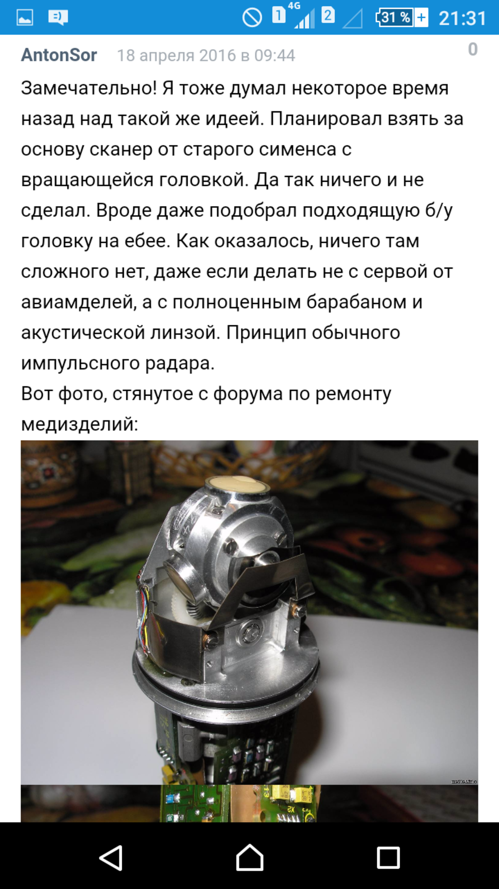

# Sondes d'occasion  - 2016-02-21

Yop,   ATL a sorti a une époque des sondes trifréquences (5, 7 et 10) et ... mécaniques.  Et, oh bonté divine,  ils la vendent à 82$ (plus 40 de livraison, et 20 de frais de douane).   Ca vaudrait pas le coup de la prendre? Pour :  \- voir comment elle est concue au global  \- récupérer 3 transducteurs  \- voir la mécanique   Let me know!   Topette

### **Hyacinthe** - 2016-02-22 at 1:00 PM

je plussoie ;)

### **Hyacinthe** - 2016-04-16 at 5:45 PM

hi hi,   Gabriel Perraud, du hakerspace Nicelab, vient de récupérer une sonde endo- cavitaire et souhaite la désosser pour comprendre le dispo. Et il nous demande si ce serait une bonne façon de nous aider. Si vous avez en tête des points qu'on pourrait leur proposer de faire, et mettre en perspective une dissémination, je transmets !   btw, on pourrait faire un remote apéro avec le nicelab   @++

### **Hyacinthe** - 2016-04-16 at 5:49 PM

Sure! Y'a du dessossage deja sur le wiki, categorie retroengineering, sur 3 sondes (et une pas posée apparament pour des questions de PI), il peut s'en inspirer.   Par contre ca peut etre interessant de savoir des maintenant si il a bien une sonde méca, et pas un array (il peut communiquer le modele?) =)   Idée : pourquoi pas l'inviter sur le basecamp et le mettre sur un thread dédié à ce démontage?

### **Hyacinthe** - 2016-04-18 at 7:34 PM

Si ça peut aider, j'ai trouvé un mec qui a désossé la même trifrequence que nous (mec trouve sur geektimes).. Ping @bHyacinthe @Hyacinthe   

[Screenshot_2016-04-18-21-31-43.png 486 KB • Download](../bc3-images/3845549-screenshot_2016-04-18-21-31-43.png)

### **Hyacinthe** - 2016-04-24 at 4:04 PM

Quoi de neuf pour ce hacker de sonde?

### **Hyacinthe** - 2016-04-25 at 7:05 AM

il me dit qu'il est en partiel jusqu'à fin mai et qu'il commence le désossage cet été ;)

### **Hyacinthe** - 2016-06-18 at 2:37 PM

Hyacinthe lacenne   Faut lui dire  qu'on a fait remarcher la notre sur : <https://github.com/kelu124/echomods/tree/master/retro10PV>

### **Hyacinthe** - 2016-06-30 at 9:47 AM

Deux sondes d'occasions assez sympa pour démontage et analyse (mécanique / materiaux / piezos):  <http://www.ebay.com/itm/Philips-ATL-Access-A-3Mhz-Ultrasound-Scanhead- Transducer-Probe-/262496926313?hash=item3d1e093a69:g:psAAAOSwcL5XMe0n> (50$)  <http://www.ebay.com/itm/Hitachi-Ultrasound-Probe-EZU- PM3-/400943782280?hash=item5d5a1c9988:g:cdAAAOSwyQtVga8m> (30$)

